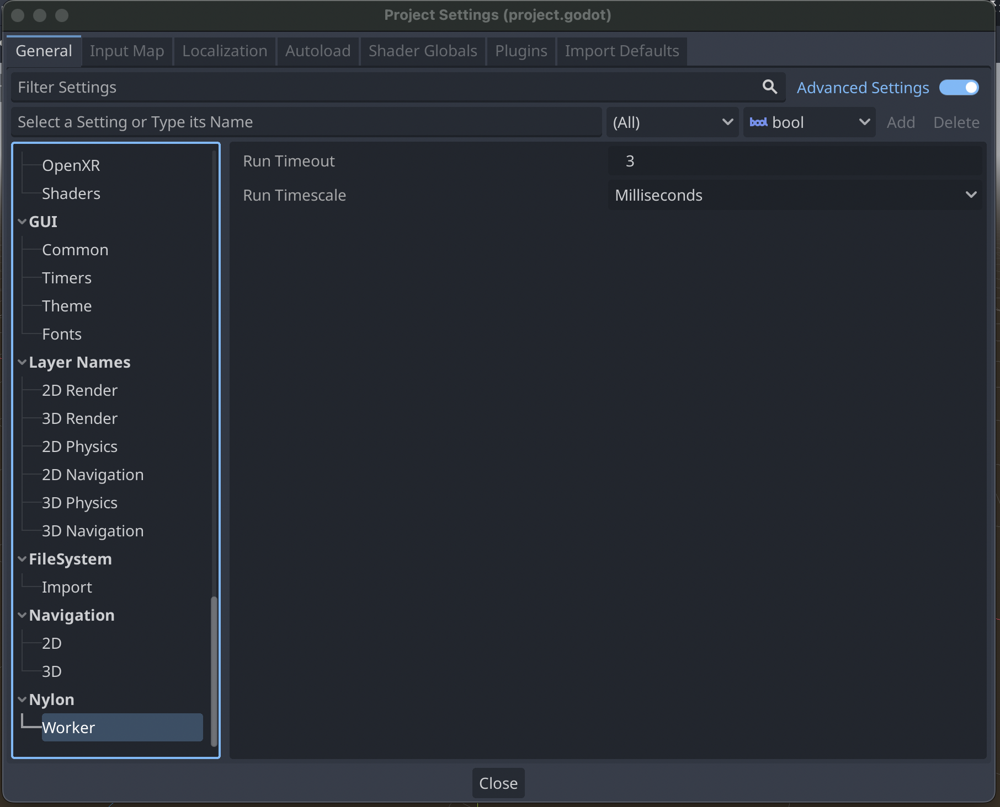

# Nylon

A gdscript module that runs coroutines asynchronously.

## Purpose

This library gives the feeling of threads without some of the headaches.

Threading can be used to improve performance or allow running logic seperate from the main loop but in most cases come with their own problems including:
* Lack of [Thread-safe APIs](https://docs.godotengine.org/en/latest/tutorials/performance/thread_safe_apis.html)
* Managing threading primitives [Mutex and Semaphore](https://docs.godotengine.org/en/latest/tutorials/performance/using_multiple_threads.html)
* Not able to use editor break-points for debugging

Nylon makes use of the `await` to pause a function. It uses the main thread so you avoid issues above with threads. Instead it requires users to chunk work using `await` to give back control to the main game loop.

## Example

Say you have the following function which when called users will experience lag.

```gdscript
func update_nodes():
    for child in get_children():
        update_child(child) # performance bottle-neck
```

The performance issue could be due to having hundreds of nodes to update. If this update could occur in the background and infrequently it might be worth using Nylon to perform the work. Using Nylon this function could be refactored like so:

```gdscript
func update_nodes(runner: NylonRunner):
    for child in get_children():
        update_child(child)
        await runner.resumed
```

It can then be run async by nylon with the following call:

```gdscript
NylonWorker.create_task(update_nodes)
```

Now Nylon will now update 1 node over the next hundred frames which could improve the user experience.

## Settings

Settings can be found under the `Nylon` section in the project settings.



### Run Timeout

Tasks added to the `NylonWorker` will timeout after this amount of time in order to give back control to the game loop. This can prevent the game from lagging by using low numbers and more work gets done each frame with higher numbers. This is the overall time Nylon will spend processing. If it cannot finish all tasks in the queue it will continue where it left of in the next iteration of the game loop.

### Run Timescale

The time scale for the Run Timeout.

## Configuring

Processing only 1 update per frame of a game might not be ideal. You can write your tasks to only yield before or after a large amount of work has occurred but Nylon makes it easy to configure how it runs each task. Supply a config in the second argument when adding a task.

```gd
var config := NylonConfig.new()
config.run_for(2).milliseconds() # Process nodes for 2 milliseconds
config.resume_after(1.5).seconds() # Take breaks of 1.5 seconds
config.repeat_after(2).seconds() # Repeat after 2 seconds
config.repeat(-1) # Repeat forever

NylonWorker.create_task(update_nodes, config)
```

### Run For

How long to run the function before pausing. It resumes the function until the time elapses. By default it runs for at least `0` milliseconds.

### Resume After

How long to wait before resuming the function. By default resumes after `0` milliseconds.

### Repeat After

How long to wait before repeating the function. By default waits `0` milliseconds.

### Timescale

All functions above use milliseconds by default but you choose the timescale. There are many timescales supported by default such as `microseconds`, `milliseconds`, `seconds`, `minutes`, `hours`, or `days`.

```gd
var config := NylonConfig.new()
config.run_for(2).microseconds() # Process nodes for 2 microseconds
config.resume_after(1.5).minutes() # Take breaks of 1.5 minutes
config.repeat_after(2).hours() # Repeat after 2 hours
```

### Repeat

How many times to repeat the function. By default tasks are only run once. Supplying a value of `-1` runs a task until it's cancelled.

## Tasks

`NylonWorker` returns a task once created. You can use that task to wait or even cancel it.

## Waiting

The `completed` signal will wait until the jobs ends and will return the final result of `return`.

```gd
var task := NylonWorker.create_task(update_nodes)
await task.completed
if task.is_done(): # Check if the task completed successfully
  print(task.get_result())
```

### Cancelling

Eventually all jobs come to an end. Nylon manages tasks on it's own but you have control as well.

#### Forced

You can stop a task from repeating with `stop`.

```gd
var task := NylonWorker.create_task(update_nodes)
task.stop() # Stop repeating the task
```

Call `cancel` on a task returned by Nylon in order to end the task.
This means it won't finish resuming leaving the current job unfinished.
Emits `completed` immedately but the `is_done` function will be `false`.

```gd
var task := NylonWorker.create_task(update_nodes)
task.cancel() # Cancel the job immediately
```

A job can also cancel itself by calling a `cancel` on `NylonRunner`.

```gd
func update_nodes(runner: NylonRunner):
  # Processing ...
  runner.cancel() # Stop executing
```

#### Expired Tasks

Tasks can expire if the owner of the job no longer exists, this could happen if an object is destroyed such as a scene.
